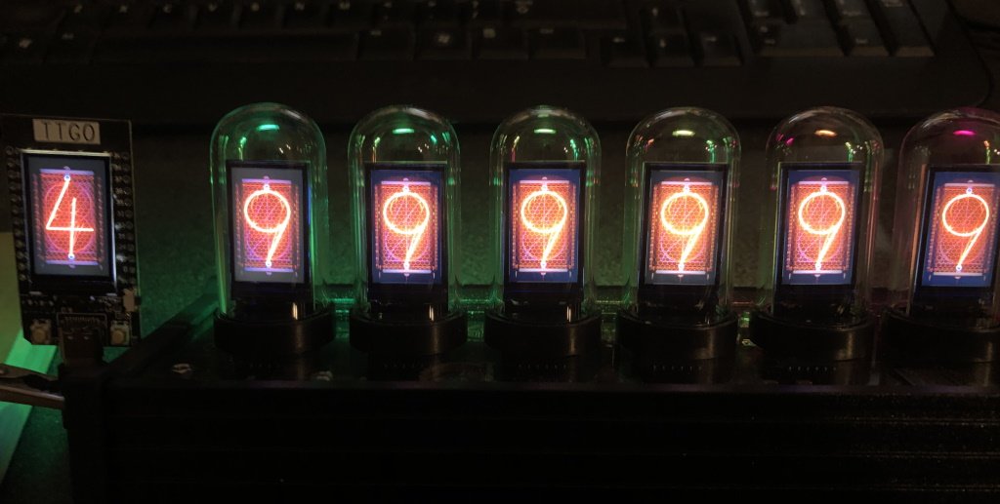

# Extract retro digits from EleksTube IPS Clock Firmware
The retro nixie digits in the Elekstube IPS clock, can be extracted from the firmware binary of your clock using the instructions below.

They can be displayed on any 1.14" 135x240 IPS LCD display (and probably others that support 16bpp RGB565).
The ESP32 arduino code can be compiled for the clock as well as the TTGO T-display module. See the `TTGO_T-DISPLAY` define in the code.



## Arduino Library dependencies for retro-digits example code
See https://github.com/SmittyHalibut/EleksTubeHAX#install-libraries for details on the TFT_eSPI library and how to configure the library for the clock.

# Extraction instructions
All extraction and conversion steps were done in Linux using the standard tools:

- `esptool.py` https://github.com/espressif/esptool
- `dd` (part of most Linux distributions)
- `xxd` (part of most Linux distributions) 

To extract the contents of the retro.h file, follow these steps:

Backup the firmware from your Elekstube IPS Clock
```cpp
esptool.py --baud 115200 --port [COM port] read_flash 0x0 0x0400000 my_fw-backup-4M.bin
```

Extract the binary data containing the retro digits 9-0
```cpp
dd if=my_fw-backup-4M.bin of=retro.bin skip=$((0x15d9a8-10*64800)) count=$((270*2640)) iflag=skip_bytes,count_bytes
```

Create a C Header file from the binary data
```cpp
xxd -i -a retro.bin >retro.h
```

Finally, edit the retro.h file and replace "unsigned char" with "static const uint8_t"


# Bonus digits
There are additional digits you can extract.

Punk digits:
```cpp
dd if=my_fw-backup-4M.bin of=punk.bin skip=$((0x15d9a8-20*64800)) count=$((270*2640)) iflag=skip_bytes,count_bytes
```

Retro unpowered grid:
```cpp
dd if=my_fw-backup-4M.bin of=retro-grid.bin skip=$((0x15d9a8-21*64800)) count=$((270*240)) iflag=skip_bytes,count_bytes
```

Everything I could find in the firware:
```cpp
dd if=myfw-backup-4M.bin of=all.bin skip=$((0x15d9a8-21*64800)) count=$((270*5280)) iflag=skip_bytes,count_bytes
```
